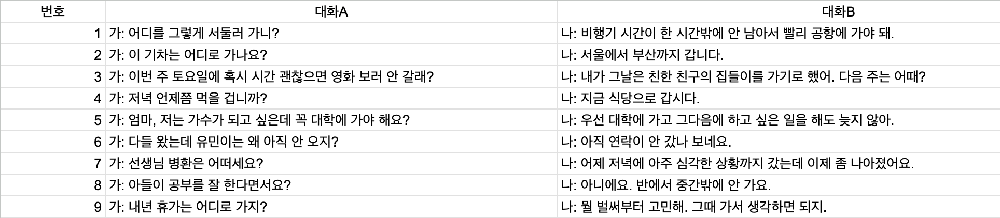

# single_turn_dialogue
한국어 기초 사전에서 대화로 구성된 예문만 추출한 데이터

- 국립국어원 사이트에서 다운로드할 수 있는 사전 데이터 중 [한국어 기초 사전](https://krdict.korean.go.kr/mainAction)이 이 데이터의 원천 데이터임

-  실제 추출에는 다음 링크에서 다운로드(2020/03/25) 받아 둔 데이터를 사용했음
https://github.com/spellcheck-ko/korean-dict-nikl 

# 크기
10,141개의 단일 말차례(single turn)를 대화쌍으로 구성

# 저작권      
원천 데이터인 한국어 기초 사전 사전과 동일한 크리에이티브 커먼즈 저작자표시-동일조건변경허락 2.0 대한민국 라이선스

# Quick peek

